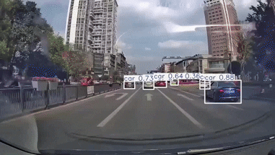

# Object Detection for Autonomous Vehicles

This project develops an object detection system optimized for autonomous vehicles, using the YOLO architecture for real-time detection. It is trained and tested on the COCO Dataset.



## Table of Contents

- [Overview](#overview)
- [Dataset](#dataset)
- [Installation](#installation)
- [Usage](#usage)

## Overview

Object detection is critical for the safe operation of autonomous vehicles. This system uses YOLOv8 to detect objects in real-time from video streams, focusing on optimizing accuracy and speed for autonomous driving applications.

## Dataset

We use the [COCO Dataset](https://cocodataset.org/) for training and validation. Ensure the download the dataset and place it in the `data/coco/` folder.

## Installation

1. Clone the repository:
   
   ```bash
   git clone https://github.com/hmatoui-username/object-detection-autonomous-vehicles.git
   cd object-detection-autonomous-vehicles
   ```

2. Install dependencies
   
   ```bash
   pip install -r requirements.txt
   ```

3. Set Up YOLOv8
   
   1. **Install Ultralytics Library**:
      YOLOv8 is available in the `ultralytics` package. Install it via pip:
      
      ```bash
      pip install ultralytics
      ```
   
   2. **Import the YOLOv8 Module**:
      In the Python scripts, use `from ultralytics import YOLO` to access YOLOv8's functionalities.
   
   3. **Organize the Dataset**:
      
      The dataset should be in the YOLO format:
      
      ```bash
      data/coco/
      ├── annotations
      ├── images/train2017       # Training images
      ├── images/val2017         # Validation images
      ├── labels/train2017       # Training labels
      └── labels/val2017         # Validation labels
      
      ```
   
   4. **Prepare Dataset Configuration File:**
      Create a dataset configuration file (`data/coco.yaml`): 
      
      ```bash
      path: ../datasets/coco # Dataset root directory
      train: train2017.txt # Training images directory
      val: val2017.txt # Validation images directory
      test: test-dev2017.txt # Testing images directory
      
      names:
         0: person
         1: bicycle
         2: car
         3: motorcycle
         4: airplane
         5: bus
         6: train
         7: truck
         8: boat
         9: traffic light
         10: fire hydrant
         11: stop sign
         12: parking meter
         13: bench
         14: bird
         15: cat
         16: dog
         17: horse
         18: sheep
         19: cow
         20: elephant
         21: bear
         22: zebra
         23: giraffe
         24: backpack
         25: umbrella
         26: handbag
         27: tie
         28: suitcase
         29: frisbee
         30: skis
         31: snowboard
         32: sports ball
         33: kite
         34: baseball bat
         35: baseball glove
         36: skateboard
         37: surfboard
         38: tennis racket
         39: bottle
         40: wine glass
         41: cup
         42: fork
         43: knife
         44: spoon
         45: bowl
         46: banana
         47: apple
         48: sandwich
         49: orange
         50: broccoli
         51: carrot
         52: hot dog
         53: pizza
         54: donut
         55: cake
         56: chair
         57: couch
         58: potted plant
         59: bed
         60: dining table
         61: toilet
         62: tv
         63: laptop
         64: mouse
         65: remote
         66: keyboard
         67: cell phone
         68: microwave
         69: oven
         70: toaster
         71: sink
         72: refrigerator
         73: book
         74: clock
         75: vase
         76: scissors
         77: teddy bear
         78: hair drier
         79: toothbrush

      # Download script/URL (optional)
      download: |
      from ultralytics.utils.downloads import download
      from pathlib import Path

      # Download labels
      segments = True  # segment or box labels
      dir = Path(yaml['path'])  # dataset root dir
      url = 'https://github.com/ultralytics/assets/releases/download/v0.0.0/'
      urls = [url + ('coco2017labels-segments.zip' if segments else 'coco2017labels.zip')]  # labels
      download(urls, dir=dir.parent)
      # Download data
      urls = ['http://images.cocodataset.org/zips/train2017.zip',  # 19G, 118k images
               'http://images.cocodataset.org/zips/val2017.zip',  # 1G, 5k images
               'http://images.cocodataset.org/zips/test2017.zip']  # 7G, 41k images (optional)
      download(urls, dir=dir / 'images', threads=3)
      
      ```

## Usage

### Training

Train YOLO on the COCO dataset:

```bash
python scripts/train.py --data data/coco/ --epochs 50
```

### Detection

Run object detection on images or video streams:

```bash
python scripts/test.py
```


